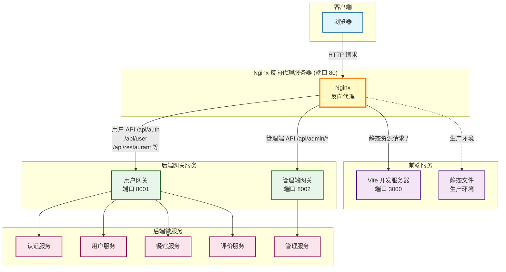
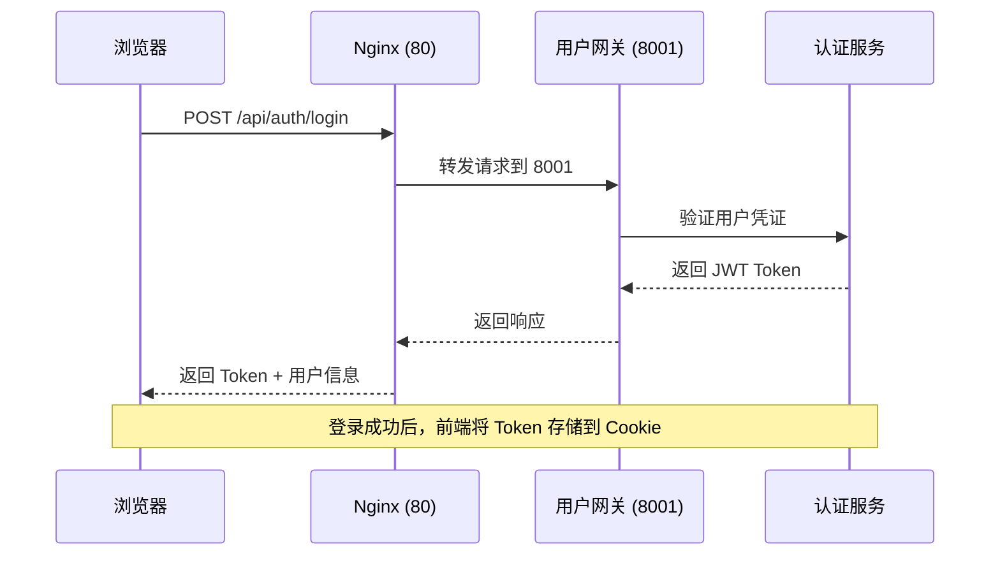
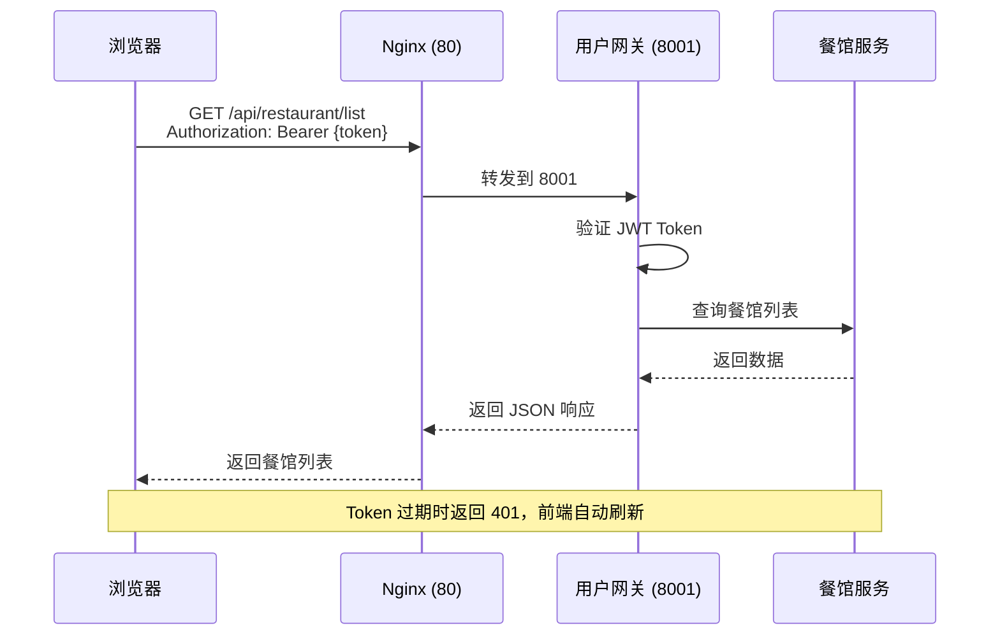
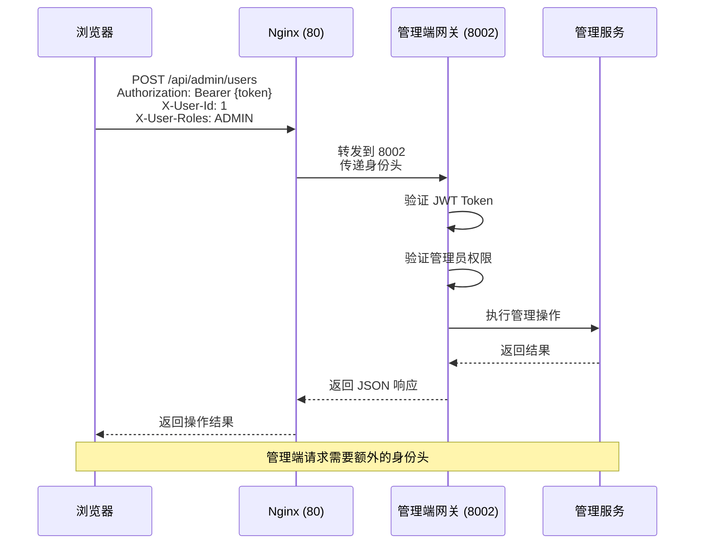
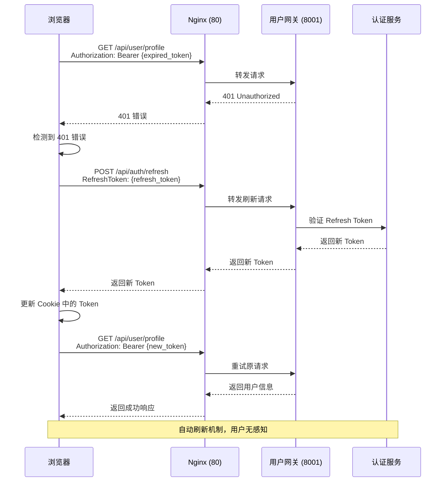
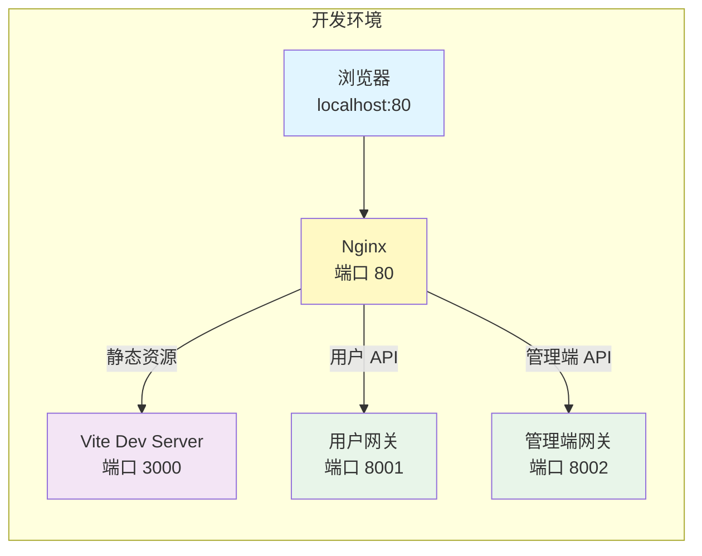
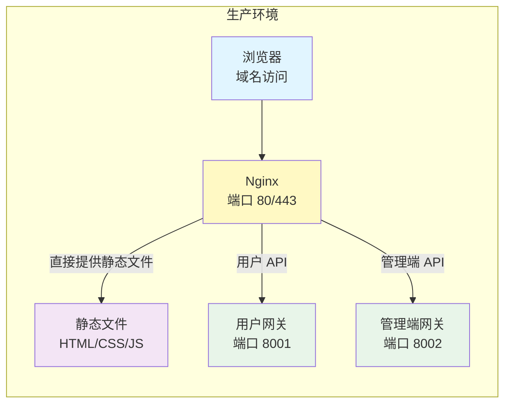
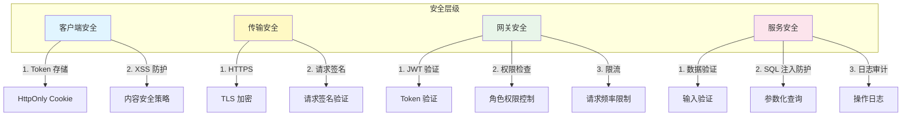
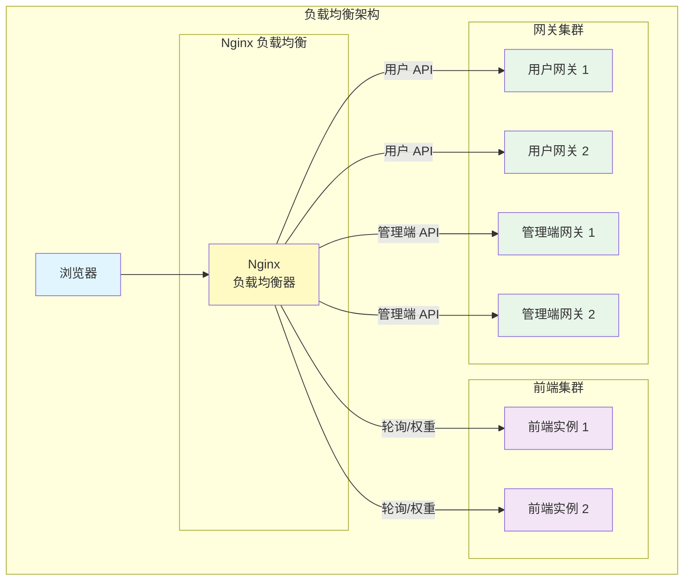

# 网络架构图

## 完整架构图

## 请求流程详解

### 1. 用户认证流程

### 2. 普通用户请求流程

### 3. 管理端请求流程

### 4. Token 刷新流程

## 开发环境 vs 生产环境

### 开发环境架构

### 生产环境架构

## 端口映射表

| 服务 | 端口 | 说明 |
|------|------|------|
| Nginx | 80 | 反向代理入口（可配置为其他端口） |
| Vite Dev Server | 3000 | 开发环境前端服务器 |
| 用户网关 | 8001 | 用户相关 API |
| 管理端网关 | 8002 | 管理端 API |

## API 路由规则

| 路径 | 目标服务 | 示例 |
|------|---------|------|
| `/` | 前端静态资源 | `/`, `/login`, `/restaurants` |
| `/api/auth/*` | 用户网关 (8001) | `/api/auth/login`, `/api/auth/register` |
| `/api/user/*` | 用户网关 (8001) | `/api/user/profile`, `/api/user/update` |
| `/api/restaurant/*` | 用户网关 (8001) | `/api/restaurant/list`, `/api/restaurant/1` |
| `/api/review/*` | 用户网关 (8001) | `/api/review/create`, `/api/review/list` |
| `/api/interaction/*` | 用户网关 (8001) | `/api/interaction/like`, `/api/interaction/favorite` |
| `/api/ranking/*` | 用户网关 (8001) | `/api/ranking/restaurants` |
| `/api/notification/*` | 用户网关 (8001) | `/api/notification/list` |
| `/api/admin/*` | 管理端网关 (8002) | `/api/admin/users`, `/api/admin/restaurants` |

## 安全机制

## 负载均衡扩展（可选）

## 总结

这个架构的核心优势：

1. **统一入口**：所有请求通过 Nginx 统一代理，简化前端配置
2. **服务隔离**：用户网关和管理端网关分离，职责清晰
3. **安全可控**：Nginx 层面可以做统一的安全控制和限流
4. **易于扩展**：后续可以轻松添加新的网关服务
5. **开发友好**：开发环境和生产环境架构一致，减少环境差异

喵~ 主人，这个架构图应该很清楚了吧！有什么不明白的地方随时问我哦~ 尾巴摇摇~ 🐱
