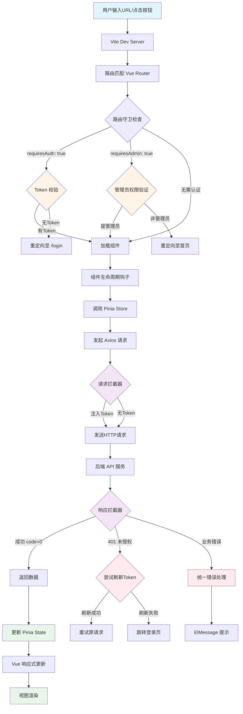

# Vue 3 + Vite + Axios 前端架构深度解析报告

## 一、整体架构可视化



## 二、核心流程详解

### 2.1 Vite 开发服务器启动机制

**启动流程**:
```typescript
// vite.config.ts 核心配置
export default defineConfig({
  plugins: [vue(), logPlugin({ logDir: 'logs' })],
  server: {
    port: 3000,
    proxy: {
      '/api': {
        target: 'http://localhost:8001',  // 代理到后端网关
        changeOrigin: true
      }
    }
  }
})
```

**关键特性**:
1. **ESM 原生支持**: 利用浏览器原生 ES 模块，无需打包即可启动
2. **HMR 热更新**: 通过 WebSocket 实现模块级别的热更新
3. **代理转发**: 开发环境将 `/api` 请求代理到 `http://localhost:8001`，解决跨域问题
4. **路径别名**: `@/*` 映射到 `src/*`，简化导入路径

### 2.2 Vue Router 路由匹配流程

**路由配置**:
```typescript
const router = createRouter({
  history: createWebHistory(),
  routes: [
    {
      path: '/profile',
      name: 'profile',
      component: () => import('@/views/user/ProfileView.vue'),
      meta: { requiresAuth: true }  // 需要登录
    },
    {
      path: '/admin/users',
      name: 'admin-users',
      component: () => import('@/views/admin/AdminUserManageView.vue'),
      meta: { requiresAuth: true, requiresAdmin: true }  // 需要管理员权限
    }
  ]
})
```

**全局前置守卫执行顺序**:
```typescript
router.beforeEach(async (to, _from, next) => {
  const userStore = useUserStore()
  const hasToken = !!getToken()

  // 1. 检查是否需要登录
  if (to.meta.requiresAuth && !hasToken) {
    next({ name: 'login', query: { redirect: to.fullPath } })
    return
  }

  // 2. 检查是否需要管理员权限
  if (to.meta.requiresAdmin) {
    if (!userStore.user && hasToken) {
      await userStore.fetchUserInfo()  // 动态加载用户信息
    }
    if (!userStore.isAdmin) {
      ElMessage.error('无权访问，仅管理员可访问此页面')
      next({ name: 'home' })
      return
    }
  }

  // 3. 已登录用户访问登录页，重定向到首页
  if (hasToken && (to.name === 'login' || to.name === 'register')) {
    next({ name: 'home' })
    return
  }

  next()
})
```

**流程图**:
```
用户访问 /profile
  ↓
检查 meta.requiresAuth
  ↓
验证 Token 存在性
  ↓ (有Token)
加载组件
  ↓
触发组件 onMounted 钩子
```

### 2.3 组件生命周期钩子

**示例：LoginView.vue 的生命周期**:
```typescript
<script setup lang="ts">
import { reactive, ref } from 'vue'
import { useRouter, useRoute } from 'vue-router'
import { useUserStore } from '@/stores/user'

// 1. 组件创建前：初始化响应式数据
const formRef = ref<FormInstance>()
const loading = ref(false)
const loginForm = reactive({
  account: '',
  password: '',
})

// 2. 组件挂载后：自动执行的操作
// （此组件没有 onMounted 钩子，但其他组件可能有）

// 3. 用户交互触发的方法
const handleLogin = async () => {
  loading.value = true
  try {
    await userStore.login(loginForm)  // 调用 Store
    router.push(redirect || '/')
  } finally {
    loading.value = false
  }
}
</script>
```

### 2.4 Axios 拦截器执行顺序

**请求拦截器链**:
```
组件调用 API
  ↓
请求拦截器
  ↓
注入 Token 到 headers.Authorization
  ↓
发送 HTTP 请求到后端
```

**响应拦截器链**:
```
后端返回响应
  ↓
响应拦截器
  ↓
判断 code 是否为 0
  ↓ (code=0)
返回 data 给调用方
  ↓ (code≠0)
统一错误处理
  ↓
ElMessage.error() 提示用户
```

## 三、关键方法与代码逻辑说明

### 3.1 Axios 实例封装

**核心代码** (`src/api/request.ts`):

```typescript
function createAxiosInstance(): AxiosInstance {
  const instance = axios.create({
    baseURL: import.meta.env.VITE_API_BASE_URL || 'http://localhost:8001',
    timeout: 15000,
    headers: { 'Content-Type': 'application/json' }
  })

  // 请求拦截器：自动注入 Token
  instance.interceptors.request.use(
    (config) => {
      const token = getToken()
      if (token) {
        config.headers.Authorization = `Bearer ${token}`
      }
      return config
    },
    (error) => {
      logger.error('请求错误:', error)
      return Promise.reject(error)
    }
  )

  // 响应拦截器：统一错误处理
  instance.interceptors.response.use(
    (response: AxiosResponse<ApiResponse<unknown>>) => {
      const res = response.data

      // 业务错误处理
      if (res.code !== 0) {
        if (res.code === 40100) {  // 未登录
          ElMessage.error('登录已过期，请重新登录')
          removeToken()
          window.location.href = '/login'
        } else if (res.code === 40300) {  // 无权限
          ElMessage.error('无权限访问')
        } else if (res.code === 42900) {  // 请求频繁
          ElMessage.warning('请求过于频繁，请稍后再试')
        } else {
          ElMessage.error(res.message || '请求失败')
        }

        return Promise.reject(new BusinessError(res.code, res.message, res.requestId))
      }

      return response
    },
    async (error) => {
      // HTTP 401: Token 过期，尝试刷新
      if (error.response?.status === 401 && !originalRequest._retry) {
        const newToken = await doRefreshToken()
        originalRequest.headers.Authorization = `Bearer ${newToken}`
        return request(originalRequest)  // 重试原请求
      }

      // 其他 HTTP 错误
      ElMessage.error('网络错误，请检查网络连接')
      return Promise.reject(error)
    }
  )

  return instance
}
```

**关键设计**:
1. **Token 自动注入**: 每次请求自动从 Cookie 读取 Token 并注入到 `Authorization` 头
2. **统一错误处理**: 业务错误（code≠0）和 HTTP 错误统一处理，避免在每个组件重复编写错误提示
3. **Token 刷新机制**: 401 错误时自动刷新 Token，刷新成功后重试原请求
4. **请求队列管理**: 使用 `isRefreshing` 标志和 `refreshSubscribers` 队列，避免多个请求同时刷新 Token

### 3.2 Store (Pinia) 状态管理

**核心代码** (`src/stores/user.ts`):

```typescript
export const useUserStore = defineStore('user', () => {
  // 状态
  const token = ref<string | null>(null)
  const user = ref<UserDTO | null>(null)
  const userId = ref<number | undefined>(getUserId())

  // 计算属性
  const isAuthenticated = computed(() => !!token.value && !!user.value)
  const isAdmin = computed(() => user.value?.roles?.includes('ADMIN') ?? false)
  const isLoggedIn = computed(() => !!token.value)

  // 登录方法
  async function login(data: LoginRequest) {
    const res = await loginApi(data)
    const { token: newToken, userId: newUserId, refreshToken } = res.data

    token.value = newToken
    userId.value = newUserId
    setToken(newToken)          // 存储到 Cookie
    setUserId(newUserId)

    if (refreshToken) {
      setRefreshToken(refreshToken)
    }

    await fetchUserInfo()       // 获取用户详细信息
    return res
  }

  // 获取用户信息
  async function fetchUserInfo() {
    try {
      const res = await getCurrentUser()
      user.value = res.data
    } catch (error) {
      logger.error('获取用户信息失败:', error)
      logout()
    }
  }

  // 登出
  function logout() {
    token.value = null
    user.value = null
    userId.value = undefined
    removeToken()
  }

  // 初始化（从本地存储恢复）
  async function init() {
    const savedToken = getToken()
    if (savedToken) {
      token.value = savedToken
      await fetchUserInfo()
    }
  }

  return {
    token, user, userId,
    isAuthenticated, isAdmin, isLoggedIn,
    login, register, fetchUserInfo, logout, init
  }
})
```

**关键设计**:
1. **Composition API 风格**: 使用 `setup` 语法，更灵活的逻辑复用
2. **持久化策略**: Token 存储在 Cookie（支持 HttpOnly），用户信息存储在内存
3. **自动初始化**: 应用启动时调用 `userStore.init()`，从 Cookie 恢复登录状态
4. **错误边界**: `fetchUserInfo` 失败时自动调用 `logout()`，清理无效状态

### 3.3 Vue Router 路由守卫

**核心代码** (`src/router/index.ts`):

```typescript
router.beforeEach(async (to, _from, next) => {
  const userStore = useUserStore()
  const hasToken = !!getToken()

  // 1. 需要登录但无 Token
  if (to.meta.requiresAuth && !hasToken) {
    next({ name: 'login', query: { redirect: to.fullPath } })
    return
  }

  // 2. 需要管理员权限
  if (to.meta.requiresAdmin) {
    // 动态加载用户信息（如果未加载）
    if (!userStore.user && hasToken) {
      try {
        await userStore.fetchUserInfo()
      } catch (error) {
        ElMessage.error('用户信息加载失败，请重新登录')
        next({ name: 'login' })
        return
      }
    }

    if (!userStore.isAdmin) {
      ElMessage.error('无权访问，仅管理员可访问此页面')
      next({ name: 'home' })
      return
    }
  }

  // 3. 已登录用户访问登录/注册页
  if (hasToken && (to.name === 'login' || to.name === 'register')) {
    next({ name: 'home' })
    return
  }

  next()
})
```

**关键设计**:
1. **分层权限控制**: `requiresAuth` 控制登录，`requiresAdmin` 控制管理员权限
2. **动态用户信息加载**: 只在需要管理员权限时才加载用户详细信息，减少不必要的 API 调用
3. **重定向路径保存**: 未登录用户访问受保护页面时，将原路径保存到 `query.redirect`，登录后跳回
4. **错误边界**: 用户信息加载失败时，清理状态并跳转登录页

## 四、完整数据流转闭环示例

**场景：用户点击"个人中心"按钮**

```
1. 用户点击按钮
   ↓
2. 触发 router.push('/profile')
   ↓
3. Vue Router 匹配路由
   检查 meta.requiresAuth = true
   ↓
4. 路由守卫 beforeEach 执行
   检查 Token 存在 → 有 Token
   ↓
5. 加载 ProfileView.vue 组件
   触发 onMounted 钩子
   ↓
6. 组件调用 userStore.fetchUserInfo()
   ↓
7. Store 调用 getCurrentUser() API
   ↓
8. Axios 请求拦截器执行
   从 Cookie 读取 Token
   注入到 headers.Authorization
   ↓
9. 发送 HTTP 请求到后端
   GET /api/users/me
   ↓
10. 后端返回响应
    { code: 0, data: { id: 1, nickname: "张三", ... } }
    ↓
11. Axios 响应拦截器执行
    检查 code = 0 → 成功
    ↓
12. 返回 data 给 Store
    ↓
13. Store 更新 user.value
    ↓
14. Vue 响应式系统触发
    组件重新渲染
    ↓
15. 视图更新，显示用户信息
```

## 五、架构优势与潜在优化点

### 5.1 架构优势

| 优势 | 说明 |
|------|------|
| **类型安全** | TypeScript 全栈类型检查，减少运行时错误 |
| **模块化设计** | API、Store、Router 分离，职责清晰 |
| **统一错误处理** | Axios 拦截器统一处理业务和 HTTP 错误，避免重复代码 |
| **Token 自动刷新** | 401 错误自动刷新 Token，用户无感知 |
| **权限分层控制** | 路由守卫支持多级权限（登录、管理员） |
| **持久化策略** | Cookie 存储 Token，支持 HttpOnly 和 Secure 标志 |
| **日志系统** | 使用 loglevel 记录关键操作，便于调试 |
| **代理转发** | 开发环境代理解决跨域，生产环境直连后端 |

### 5.2 潜在优化点

| 优化点 | 当前实现 | 建议改进 |
|--------|----------|----------|
| **Token 存储** | Cookie（前端设置） | 后端设置 HttpOnly Cookie，防止 XSS 攻击 |
| **请求重试** | 仅 401 错误重试 | 扩展到网络错误、5xx 错误的指数退避重试 |
| **Loading 状态** | 组件内部管理 | 在 Store 中统一管理全局 Loading 状态 |
| **数据缓存** | 无缓存机制 | 使用 Pinia 持久化插件或 LocalStorage 缓存用户信息 |
| **错误边界** | ElMessage 提示 | 添加全局错误边界组件，捕获组件渲染错误 |
| **请求取消** | 无取消机制 | 使用 AbortController 取消未完成请求 |
| **性能监控** | 无监控 | 添加 Axios 拦截器记录请求耗时，上报性能数据 |
| **路由懒加载** | 已实现 | 添加路由预加载策略，提升用户体验 |

### 5.3 安全性建议

1. **CSRF 防护**: 当前使用 `sameSite: 'Strict'`，建议后端添加 CSRF Token 验证
2. **XSS 防护**: Token 改为后端设置 HttpOnly Cookie，前端无法通过 JS 读取
3. **敏感信息**: 避免在 URL 参数中传递敏感信息（如 Token），使用 POST 请求体
4. **HTTPS**: 生产环境强制使用 HTTPS，Cookie 设置 `secure: true`

---

## 六、总结

该架构采用了现代化的 Vue 3 技术栈，通过 Axios 拦截器实现了统一的请求/响应处理，Pinia 提供了简洁的状态管理，Vue Router 的路由守卫实现了分层权限控制。整体设计清晰、模块化程度高，适合中小型项目快速迭代。建议在安全性（Token 存储）和性能优化（请求重试、数据缓存）方面进一步改进。

**技术栈版本**:
- Vue 3.4.21 (Composition API)
- Vite 5.2.0
- Axios 1.6.8
- Pinia 2.1.7
- Vue Router 4.3.0
- Element Plus 2.6.1
- TypeScript 5.4.3

**文档生成时间**: 2026-03-30
