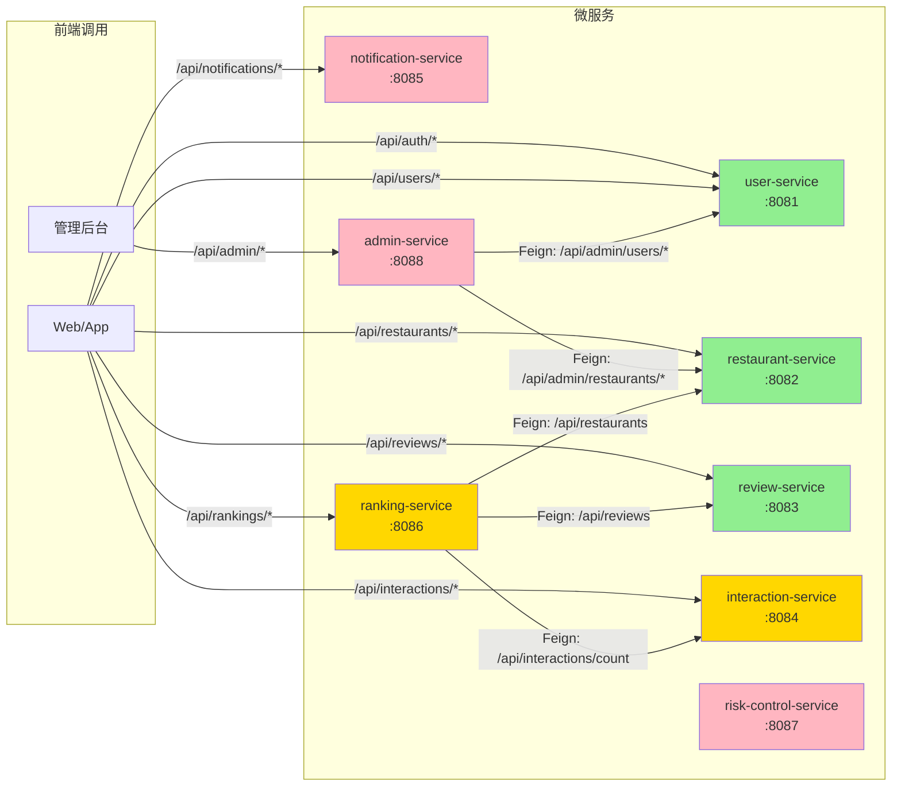
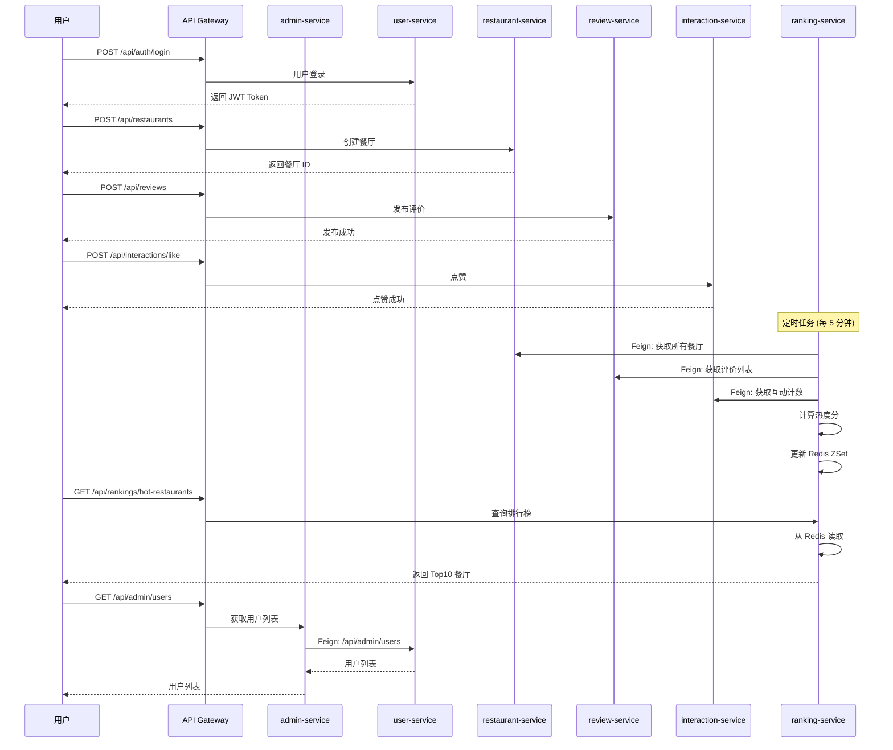

# Campus Review 微服务架构分析报告

## 一、微服务列表与功能

| 序号 | 服务名                      | 端口   | 功能作用                                         | 服务类型         |
|------|--------------------------|--------|------------------------------------------------|----------------|
| 1    | **user-service**         | 8081   | 用户注册、登录、JWT 签发、Token 刷新、用户信息管理     | 核心业务服务     |
| 2    | **restaurant-service**   | 8082   | 餐厅信息 CRUD、图片上传 (MinIO)、餐厅搜索            | 核心业务服务     |
| 3    | **review-service**       | 8083   | 评价发布、评价查询、我的评价                         | 核心业务服务     |
| 4    | **interaction-service**  | 8084   | 点赞/取消点赞、收藏/取消收藏、互动计数查询             | 核心业务服务     |
| 5    | **notification-service** | 8085   | 站内消息投递、收件箱查询、消息已读标记                | 支撑服务         |
| 6    | **ranking-service**      | 8086   | 热门餐厅排行榜计算、热度分计算、排行榜缓存 (Redis)      | 核心业务服务     |
| 7    | **admin-service**        | 8088   | 后台统一管理入口、用户/餐厅管理编排                   | 支撑服务 (BFF 层) |

---

## 二、各微服务 API 接口详情

### 2.1 user-service (用户服务)

| 接口路径 | 方法 | 调用类型 | 说明 |
|----------|------|----------|------|
| `/api/auth/register` | POST | 前端调用 | 用户注册 |
| `/api/auth/login` | POST | 前端调用 | 用户登录 (签发 JWT) |
| `/api/auth/refresh` | POST | 前端调用 | 刷新 Access Token |
| `/api/users/me` | GET | 前端调用 | 获取当前用户信息 |
| `/api/admin/users` | GET | **内部调用** | 获取用户列表 (admin-service 调用) |
| `/api/admin/users/{id}/ban` | POST | **内部调用** | 封禁用户 |
| `/api/admin/users/{id}/unban` | POST | **内部调用** | 解封用户 |
| `/api/health` | GET | 基础设施 | 健康检查 |
| `/api/health/ready` | GET | 基础设施 | 就绪检查 |

### 2.2 restaurant-service (餐厅服务)

| 接口路径 | 方法 | 调用类型 | 说明 |
|----------|------|----------|------|
| `/api/restaurants` | POST | 前端调用 | 创建餐厅 (JSON) |
| `/api/restaurants/with-image` | POST | 前端调用 | 创建餐厅 (带图片) |
| `/api/restaurants/{id}` | GET | 前端调用 | 查询餐厅详情 |
| `/api/restaurants/by-ids` | GET | 前端调用 | 批量查询餐厅 |
| `/api/restaurants` | GET | 前端调用 | 搜索餐厅 |
| `/api/admin/restaurants` | GET | **内部调用** | 获取餐厅列表 (admin-service 调用) |
| `/api/admin/restaurants` | POST | **内部调用** | 创建餐厅 (admin 调用) |
| `/api/admin/restaurants/{id}` | DELETE | **内部调用** | 删除餐厅 (admin 调用) |
| `/api/files/upload` | POST | 前端调用 | 文件上传到 MinIO |

### 2.3 review-service (评价服务)

| 接口路径 | 方法 | 调用类型 | 说明 |
|----------|------|----------|------|
| `/api/reviews` | POST | 前端调用 | 发布评价 |
| `/api/reviews?restaurantId=` | GET | 前端调用 | 查询餐厅评价 |
| `/api/reviews/me` | GET | 前端调用 | 查询我的评价 |

### 2.4 interaction-service (互动服务)

| 接口路径 | 方法 | 调用类型 | 说明 |
|----------|------|----------|------|
| `/api/interactions/like` | POST | 前端调用 | 点赞 |
| `/api/interactions/unlike` | POST | 前端调用 | 取消点赞 |
| `/api/interactions/favorite` | POST | 前端调用 | 收藏 |
| `/api/interactions/unfavorite` | POST | 前端调用 | 取消收藏 |
| `/api/interactions/count?targetType=&targetId=` | GET | 前端调用 | 查询互动计数 |

### 2.5 notification-service (通知服务)

| 接口路径 | 方法 | 调用类型 | 说明 |
|----------|------|----------|------|
| `/api/notifications/send` | POST | 前端调用 | 投递消息 |
| `/api/notifications/inbox` | GET | 前端调用 | 查询收件箱 |
| `/api/notifications/{id}/read` | POST | 前端调用 | 标记已读 |

### 2.6 ranking-service (排行榜服务)

| 接口路径 | 方法 | 调用类型 | 说明 |
|----------|------|----------|------|
| `/api/rankings/hot-restaurants?topN=10` | GET | 前端调用 | 热门餐厅排行榜 |

### 2.7 admin-service (后台管理服务)

| 接口路径 | 方法 | 调用类型 | 说明 |
|----------|------|----------|------|
| `/api/admin/users` | GET | 前端调用 | 获取用户列表 |
| `/api/admin/users/{id}/ban` | POST | 前端调用 | 封禁用户 |
| `/api/admin/users/{id}/unban` | POST | 前端调用 | 解封用户 |
| `/api/admin/restaurants` | GET | 前端调用 | 获取餐厅列表 |
| `/api/admin/restaurants` | POST | 前端调用 | 创建餐厅 |
| `/api/admin/restaurants/{id}` | DELETE | 前端调用 | 删除餐厅 |

---

## 三、Feign Client 调用关系

### admin-service 的 Feign 调用

```
admin-service
├── UserServiceClient → user-service
│   ├── GET  /api/admin/users
│   ├── POST /api/admin/users/{id}/ban
│   └── POST /api/admin/users/{id}/unban
│
└── RestaurantServiceClient → restaurant-service
    ├── GET    /api/admin/restaurants
    ├── POST   /api/admin/restaurants
    └── DELETE /api/admin/restaurants/{id}
```

### ranking-service 的 Feign 调用

```
ranking-service
├── ReviewServiceClient → review-service
│   └── GET /api/reviews?restaurantId={id}
│
├── InteractionServiceClient → interaction-service
│   └── GET /api/interactions/count?targetType=&targetId=
│
└── RestaurantServiceClient → restaurant-service
    ├── GET /api/restaurants
    └── GET /api/restaurants/by-ids?ids=
```

---

## 四、可移除的微服务分析

### 建议移除/合并的服务

| 服务 | 移除优先级 | 原因 | 建议方案 |
|------|------------|------|----------|
| **admin-service** | ⭐⭐⭐⭐⭐ 高 | 仅是 BFF 编排层，无独立业务逻辑。所有功能都可通过直接调用 user-service 和 restaurant-service 的内部接口实现 | 移除，前端直接调用各服务的 /api/admin/* 接口 |
| **interaction-service** | ⭐⭐⭐ 中 | 点赞/收藏功能简单，主要依附于评价内容。单独服务增加 RPC 调用开销 | 合并到 review-service |
| **ranking-service** | ⭐⭐ 中 | 排行榜是餐厅数据的衍生功能，当前依赖 3 个外部服务，增加调用链路复杂度 | 合并到 restaurant-service，作为内部定时任务 |
| **notification-service** | ⭐ 低 | 功能独立，但使用频率低，可考虑合并 | 可选合并到 user-service |

### 核心服务（不可移除）

| 服务 | 原因 |
|------|------|
| **user-service** | 用户认证是系统基础，JWT 签发/验证必须独立 |
| **restaurant-service** | 餐厅数据是业务核心实体 |
| **review-service** | 评价是校园点评系统的核心功能 |

### 优化后架构

```
优化前：8 个微服务
优化后：3-4 个微服务

建议保留：
1. user-service (可吸收 notification-service)
2. restaurant-service (可吸收 ranking-service、interaction-service)
3. review-service
```

---

## 五、微服务关系图 (Mermaid)

### 5.1 完整架构图

```mermaid
flowchart TB
    subgraph Client ["前端客户端"]
        Web[Web 前端]
        Admin[管理后台]
        Mobile[移动 App]
    end

    subgraph Gateway ["API Gateway / Nacos"]
        GW[API 网关]
    end

    subgraph CoreServices ["核心业务服务层"]
        subgraph UserService ["user-service :8081"]
            US_CTRL[AuthController<br/>UserController]
            US_ADMIN[AdminUserController<br/>内部接口]
            US_SVC[UserAccountService<br/>UserAdminService]
            US_DB[(MySQL<br/>user_accounts)]
        end

        subgraph RestaurantService ["restaurant-service :8082"]
            RS_CTRL[RestaurantController<br/>FileUploadController]
            RS_ADMIN[AdminRestaurantController<br/>内部接口]
            RS_SVC[RestaurantAppService<br/>MinioService]
            RS_DB[(MySQL<br/>restaurants)]
            MINIO[MinIO<br/>图片存储]
        end

        subgraph ReviewService ["review-service :8083"]
            RV_CTRL[ReviewController]
            RV_SVC[ReviewAppService]
            RV_DB[(MySQL<br/>reviews)]
        end

        subgraph InteractionService ["interaction-service :8084"]
            INT_CTRL[InteractionController]
            INT_SVC[InteractionAppService]
            INT_DB[(MySQL<br/>likes/favorites)]
        end

        subgraph RankingService ["ranking-service :8086"]
            RK_CTRL[RankingController]
            RK_SVC[HotRestaurantRankingService<br/>定时任务]
            RK_DB[(MySQL<br/>hot_restaurant_ranks)]
            REDIS[Redis<br/>ZSet 排行榜缓存]
        end
    end

    subgraph SupportServices ["支撑服务层"]
        subgraph NotificationService ["notification-service :8085"]
            NT_CTRL[NotificationController]
            NT_SVC[NotificationAppService]
            NT_DB[(MySQL<br/>messages)]
        end

        subgraph RiskControlService ["risk-control-service :8087"]
            RC_CTRL[RiskControlController]
            RC_SVC[RiskControlAppService<br/>RateLimiter]
            REDIS_RC[Redis<br/>限流计数]
        end

        subgraph AdminService ["admin-service :8088"]
            ADM_CTRL[AdminController]
            ADM_SVC[AdminOrchestratorService]
            ADM_FEIGN_USER[UserServiceClient]
            ADM_FEIGN_RS[RestaurantServiceClient]
        end
    end

    %% 前端调用
    Web --> GW
    Admin --> GW
    Mobile --> GW
    GW --> US_CTRL
    GW --> RS_CTRL
    GW --> RV_CTRL
    GW --> INT_CTRL
    GW --> NT_CTRL
    GW --> RK_CTRL
    GW --> ADM_CTRL

    %% admin-service Feign 调用
    ADM_CTRL --> ADM_SVC
    ADM_SVC --> ADM_FEIGN_USER
    ADM_SVC --> ADM_FEIGN_RS
    ADM_FEIGN_USER --> US_ADMIN
    ADM_FEIGN_RS --> RS_ADMIN

    %% ranking-service Feign 调用
    RK_CTRL --> RK_SVC
    RK_SVC -.Feign.-> RV_CTRL
    RK_SVC -.Feign.-> INT_CTRL
    RK_SVC -.Feign.-> RS_CTRL

    %% 服务内部调用
    US_CTRL --> US_SVC --> US_DB
    RS_CTRL --> RS_SVC --> RS_DB
    RS_SVC --> MINIO
    RV_CTRL --> RV_SVC --> RV_DB
    INT_CTRL --> INT_SVC --> INT_DB
    RK_CTRL --> RK_SVC --> RK_DB
    RK_SVC --> REDIS
    NT_CTRL --> NT_SVC --> NT_DB
    RC_CTRL --> RC_SVC --> REDIS_RC

    %% 样式
    style CoreServices fill:#e1f5ff
    style SupportServices fill:#fff4e1
    style Gateway fill:#f0f0f0
```



### 5.2 简化调用关系图



### 5.3 数据流向图



---

## 六、端口汇总

| 服务名 | 端口 | 环境 |
|--------|------|------|
| user-service | 8081 | all |
| restaurant-service | 8082 | all |
| review-service | 8083 | all |
| interaction-service | 8084 | all |
| notification-service | 8085 | all |
| ranking-service | 8086 | all |
| risk-control-service | 8087 | all |
| admin-service | 8088 | all |

---

## 七、技术栈汇总

| 技术 | 用途 | 使用服务 |
|------|------|----------|
| Spring Boot 3.x | 应用框架 | 全部 |
| Spring Cloud Alibaba | 微服务框架 | 全部 |
| Nacos | 注册中心 + 配置中心 | 全部 |
| MyBatis-Plus | ORM 框架 | 全部 |
| MySQL | 关系型数据库 | 全部 |
| Redis | 缓存 + 排行榜 + 限流 | ranking-service, risk-control-service |
| MinIO | 对象存储 | restaurant-service |
| OpenFeign | 服务间调用 | admin-service, ranking-service |
| JWT | Token 认证 | user-service |
| SpringDoc OpenAPI | API 文档 | 全部 |
| Flyway | 数据库版本管理 | 全部 |

---

## 八、结论

### 当前架构问题
1. **过度拆分**: 8 个服务对于校园点评场景过于碎片化
2. **调用链路长**: ranking-service 依赖 3 个服务，故障面增加
3. **admin-service 冗余**: 仅是 BFF 层，无独立业务价值
4. **风控服务定位模糊**: 敏感词审核应本地调用，限流应在网关

### 优化建议
1. **移除 admin-service**: 前端直接调用各服务的 /api/admin/* 接口
2. **合并 interaction-service 到 review-service**: 点赞收藏依附于评价
3. **合并 ranking-service 到 restaurant-service**: 排行榜是餐厅数据衍生
4. **拆除 risk-control-service**: 改为工具类或网关插件

### 目标架构
```
3 个核心服务:
├── user-service (用户 + 通知)
├── restaurant-service (餐厅 + 排行榜 + 互动)
└── review-service (评价)
```
