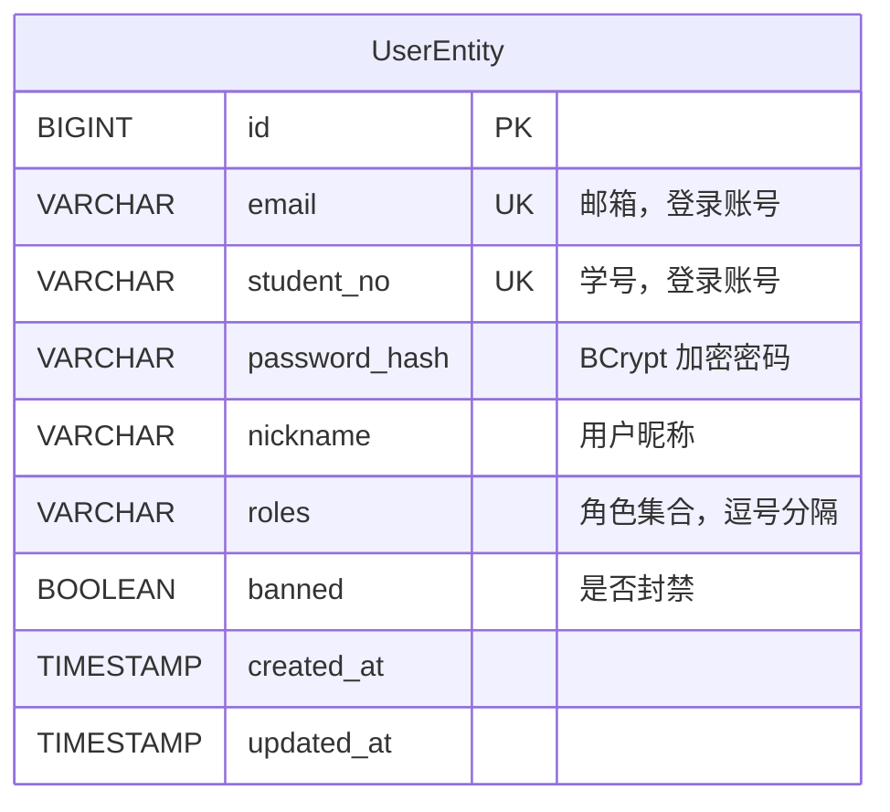
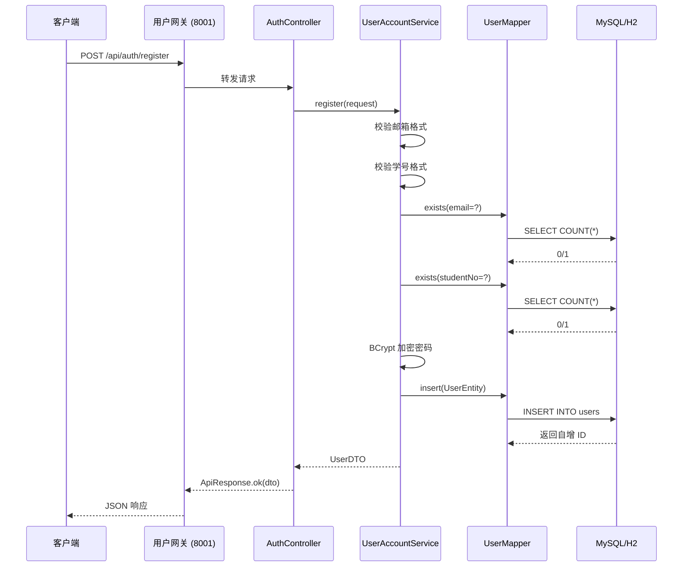
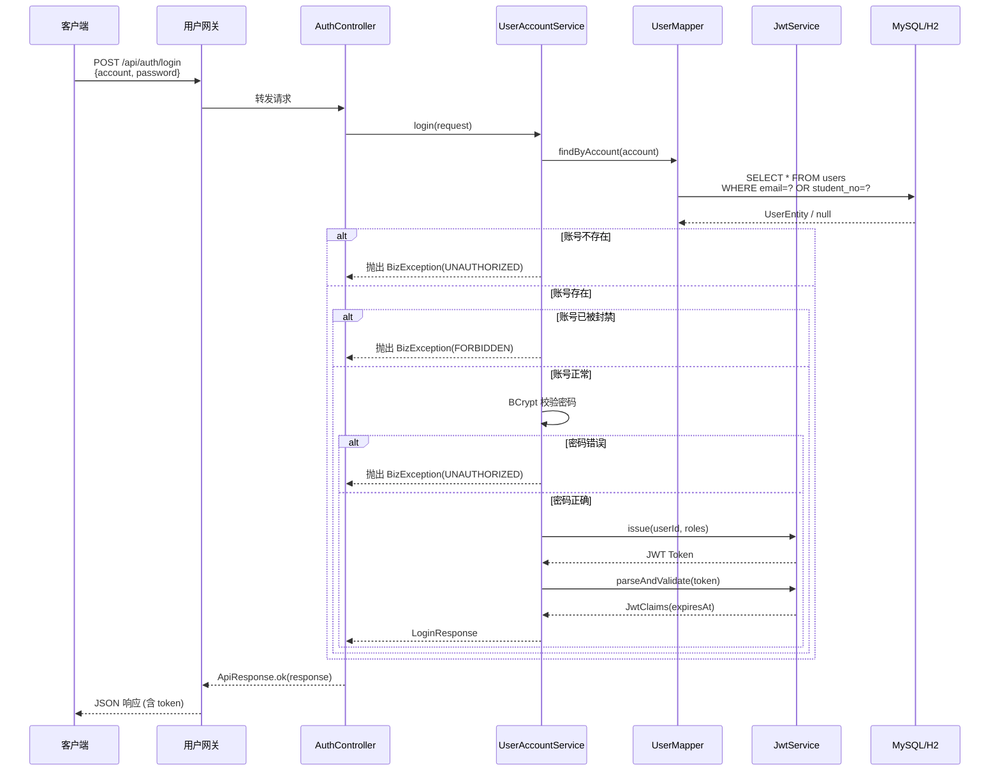
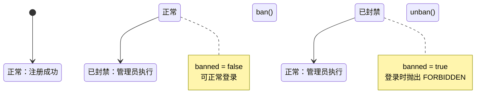
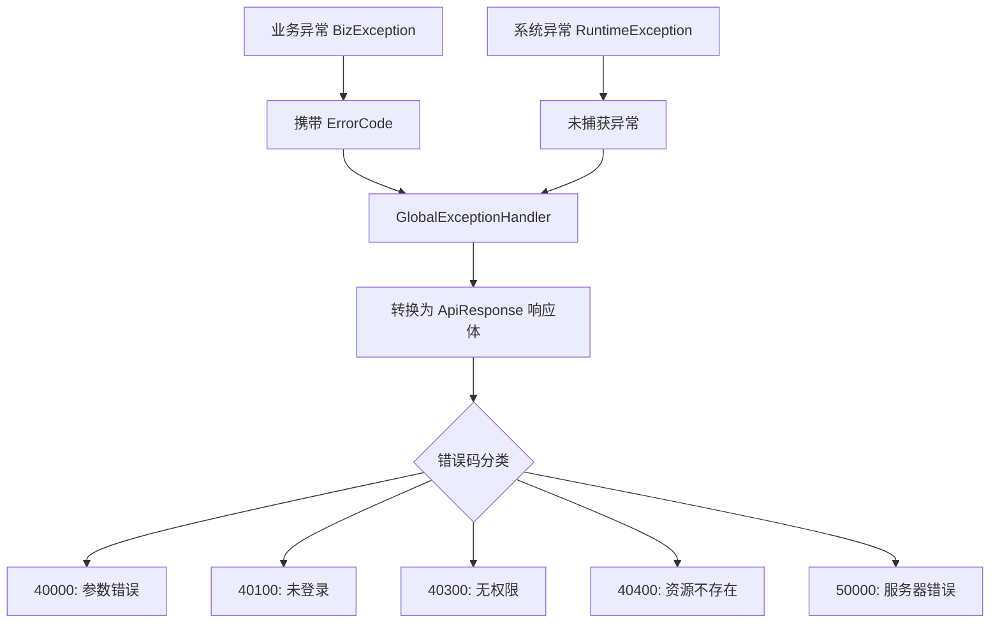
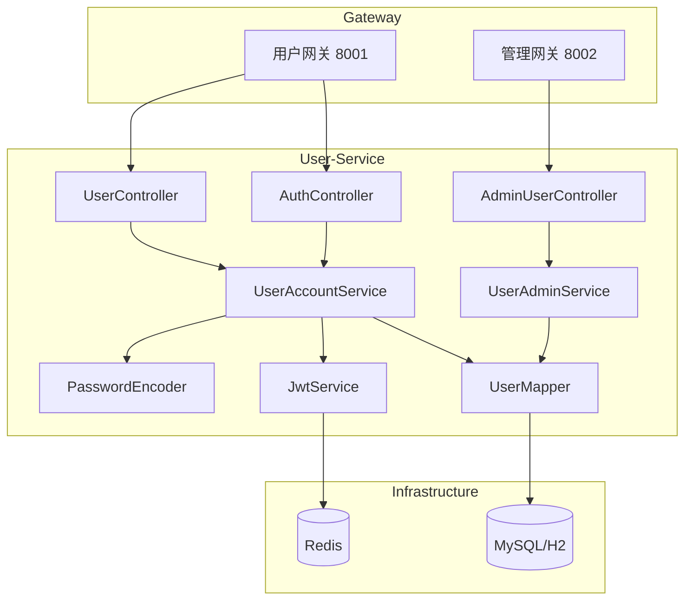

# User-Service 微服务业务逻辑分析报告

> 文档版本：v1.0  
> 分析日期：2026 年 3 月 20 日  
> 分析对象：campus-review-service/user-service

---

## 1. 核心业务领域识别

### 1.1 业务域定位

**user-service** 是 Campus Review 平台的**用户认证与账号管理中心**，负责以下核心业务域：

| 业务域        | 说明            |
|------------|---------------|
| **用户认证**   | 注册、登录（JWT 签发） |
| **用户信息管理** | 当前登录用户信息查询    |
| **用户状态管理** | 账号封禁/解封（后台管理） |

### 1.2 关键业务实体及关系



**核心实体说明：**

- **UserEntity**：用户聚合根，包含认证凭证（密码散列）、身份标识（邮箱/学号）、权限信息（角色、封禁状态）
- **角色体系**：
  - `USER`：普通用户（默认）
  - `ADMIN`：管理员（可执行封禁操作）

---

## 2. 关键链路流程分析

### 2.1 核心场景一：用户注册

#### 文字描述流程

1. **请求入口**：`POST /api/auth/register` → `AuthController.register()`
2. **参数校验**：
   - 邮箱格式校验（`CampusAccountValidator.isValidEmail()`）
   - 学号格式校验（`CampusAccountValidator.isValidStudentNo()`）
3. **唯一性检查**：
   - 查询邮箱是否已注册
   - 查询学号是否已注册
4. **密码加密**：使用 `BCryptPasswordEncoder` 对明文密码进行散列
5. **数据持久化**：插入用户记录，默认角色 `USER`，`banned=false`
6. **返回结果**：转换为 `UserDTO` 返回

#### 时序图



---

### 2.2 核心场景二：用户登录（JWT 签发）

#### 文字描述流程

1. **请求入口**：`POST /api/auth/login` → `AuthController.login()`
2. **账号查找**：支持邮箱或学号登录（`findByAccount()`）
3. **状态校验**：
   - 账号不存在 → 返回"账号或密码错误"
   - 账号已被封禁 → 抛出 `FORBIDDEN` 异常
4. **密码验证**：`passwordEncoder.matches()` 比对明文与散列值
5. **JWT 签发**：
   - 解析用户角色字符串为集合
   - 调用 `JwtService.issue()` 生成 token（有效期 24 小时）
   - 解析 token 获取过期时间
6. **返回结果**：`LoginResponse(userId, roles, token, expiresAt)`

#### 时序图



---

### 2.3 核心场景三：获取当前用户信息

#### 流程说明

1. **请求入口**：`GET /api/users/me` → `UserController.me()`
2. **身份获取**：从 `UserContextHolder` 获取当前请求的用户上下文（由网关透传）
3. **数据查询**：根据 `userId` 查询用户实体
4. **返回结果**：转换为 `UserDTO`（脱敏，不含密码）

---

### 2.4 核心场景四：管理员封禁/解封用户

#### 状态流转图



#### 权限校验逻辑

```java
// UserAdminService.ban() / unban()
UserContextUtil.requireAdmin();  // 校验当前用户具备 ADMIN 角色
Long adminId = UserContextUtil.requireUserId();  // 获取管理员 ID 用于审计日志
```

---

## 3. 代码逻辑深度解读

### 3.1 关键设计模式与策略

| 模式/策略 | 应用场景 | 说明 |
|----------|---------|------|
| **ThreadLocal 上下文** | `UserContextHolder` | 在请求处理线程内共享用户身份，避免参数透传 |
| **策略模式** | `PasswordEncoder` | 使用 BCrypt 算法，支持未来平滑切换其他加密算法 |
| **Record DTO** | `UserDTO`, `LoginResponse` | 使用 Java 14+ Record 简化不可变数据传输对象 |
| **LambdaQueryWrapper** | MyBatis-Plus 查询 | 类型安全的动态 SQL 构建，避免硬编码字段名 |

### 3.2 事务与一致性分析

#### `@Transactional` 使用范围

| 方法 | 事务注解 | 说明 |
|------|---------|------|
| `UserAccountService.register()` | ✅ 有 | 保证唯一性检查 + 插入的原子性 |
| `UserAccountService.login()` | ❌ 无 | 纯查询操作，无需事务 |
| `UserAccountService.me()` | ❌ 无 | 纯查询操作，无需事务 |
| `UserAdminService.ban()` | ✅ 有 | 保证状态更新的原子性 |
| `UserAdminService.unban()` | ✅ 有 | 保证状态更新的原子性 |

#### 一致性保证

- **本地事务**：所有写操作在单服务内完成，使用 MySQL 本地事务保证 ACID
- **无分布式事务**：当前不涉及跨服务调用，不存在分布式事务问题
- **唯一性约束**：数据库层面对 `email` 和 `student_no` 建立唯一索引，防止并发注册导致的数据重复

---

### 3.3 异常处理机制

#### 异常类型与转换



#### 典型异常场景

| 场景 | 异常类型 | 错误码 | 提示信息 |
|------|---------|-------|---------|
| 邮箱格式错误 | `BizException` | `BAD_REQUEST` | "邮箱格式不正确" |
| 学号已注册 | `BizException` | `BAD_REQUEST` | "学号已注册" |
| 账号不存在 | `BizException` | `UNAUTHORIZED` | "账号或密码错误" |
| 密码错误 | `BizException` | `UNAUTHORIZED` | "账号或密码错误" |
| 账号被封禁 | `BizException` | `FORBIDDEN` | "账号已被封禁" |
| 非管理员操作 | `BizException` | `FORBIDDEN` | "无权限" |
| 用户不存在 | `BizException` | `NOT_FOUND` | "用户不存在" |

---

## 4. 数据模型与存储

### 4.1 核心表结构

```sql
CREATE TABLE users (
    id BIGINT AUTO_INCREMENT PRIMARY KEY,
    email VARCHAR(255) NOT NULL UNIQUE,        -- 邮箱，登录账号
    student_no VARCHAR(50) NOT NULL UNIQUE,    -- 学号，登录账号
    password_hash VARCHAR(255) NOT NULL,       -- BCrypt 散列密码
    nickname VARCHAR(100),                     -- 用户昵称
    avatar_url VARCHAR(500),                   -- 头像 URL（预留）
    roles VARCHAR(255) DEFAULT 'USER',         -- 角色集合，逗号分隔
    banned BOOLEAN DEFAULT FALSE,              -- 是否封禁
    ban_reason VARCHAR(500),                   -- 封禁原因（预留）
    ban_until TIMESTAMP,                       -- 封禁截止时间（预留）
    created_at TIMESTAMP DEFAULT CURRENT_TIMESTAMP,
    updated_at TIMESTAMP DEFAULT CURRENT_TIMESTAMP ON UPDATE CURRENT_TIMESTAMP,
    INDEX idx_users_email (email),
    INDEX idx_users_student_no (student_no)
);
```

### 4.2 关键字段业务含义

| 字段 | 业务含义 | 约束 |
|------|---------|------|
| `email` | 校园邮箱，唯一标识 | NOT NULL, UNIQUE |
| `student_no` | 学号，唯一标识 | NOT NULL, UNIQUE |
| `password_hash` | BCrypt 加密后的密码 | 不存储明文 |
| `roles` | 角色集合（USER/ADMIN） | 逗号分隔字符串 |
| `banned` | 封禁状态 | true=禁止登录 |

### 4.3 缓存策略（Redis）

**当前状态**：user-service 的 pom.xml 中已引入 Redis 依赖，但**当前代码未使用 Redis 缓存**。

**推断部分**（基于常见微服务最佳实践）：

| 可缓存数据 | 建议策略 | TTL |
|-----------|---------|-----|
| 用户信息 | Cache-Aside 模式 | 5 分钟 |
| 登录 Token 黑名单 | 主动写入 | 剩余有效期 |
| 频繁查询的用户 ID | 热点数据缓存 | 10 分钟 |

---

## 5. 潜在风险与优化建议

### 5.1 潜在风险

#### 5.1.1 并发注册问题

**问题描述**：在高并发场景下，两个请求同时检查邮箱是否存在，可能都返回 false，导致插入重复数据。

**当前防护**：
- 代码层：先查询后插入（存在竞态条件）
- 数据库层：唯一索引兜底

**风险等级**：🟡 中（数据库唯一约束可兜底，但会抛出 SQLIntegrityConstraintViolationException）

#### 5.1.2 密码强度校验不足

**问题描述**：当前仅校验密码长度（6-50 位），未强制要求复杂度（大小写字母 + 数字 + 特殊字符）。

**风险等级**：🟡 中

#### 5.1.3 登录失败无限流

**问题描述**：同一账号可无限次尝试登录，存在暴力破解风险。

**风险等级**：🔴 高

#### 5.1.4 Token 无主动失效机制

**问题描述**：JWT 一旦签发，在有效期内无法主动撤销（如用户修改密码后旧 token 仍可用）。

**风险等级**：🟡 中

---

### 5.2 优化建议

#### 建议一：添加登录失败限流

```java
// 推断实现 - 基于 Redis 的滑动窗口限流
@Service
public class UserAccountService {
    private final RedisTemplate<String, String> redisTemplate;
    
    public LoginResponse login(LoginRequest request) {
        String key = "login:fail:" + request.account();
        
        // 检查 5 分钟内失败次数
        Integer failCount = redisTemplate.opsForValue().get(key);
        if (failCount != null && failCount >= 5) {
            throw new BizException(ErrorCode.TOO_MANY_REQUESTS, "登录失败次数过多，请稍后再试");
        }
        
        try {
            // ... 原有登录逻辑
        } catch (BizException e) {
            // 失败计数 +1
            redisTemplate.opsForValue().increment(key);
            redisTemplate.expire(key, 5, TimeUnit.MINUTES);
            throw e;
        }
        
        // 登录成功，清除计数
        redisTemplate.delete(key);
    }
}
```

#### 建议二：引入 Token 黑名单机制

```java
// 推断实现 - 用户修改密码/登出时加入黑名单
@Service
public class JwtService {
    private final RedisTemplate<String, String> redisTemplate;
    
    public void revoke(String token) {
        JwtClaims claims = parseAndValidate(token);
        long ttl = Duration.between(Instant.now(), claims.expiresAt()).getSeconds();
        if (ttl > 0) {
            redisTemplate.opsForValue().set("token:blacklist:" + token, "1", ttl, TimeUnit.SECONDS);
        }
    }
    
    public JwtClaims parseAndValidate(String token) {
        // 解析前先检查黑名单
        if (Boolean.TRUE.equals(redisTemplate.hasKey("token:blacklist:" + token))) {
            throw new BizException(ErrorCode.UNAUTHORIZED, "Token 已失效");
        }
        // ... 原有解析逻辑
    }
}
```

---

## 6. 架构依赖关系图



---

## 7. 服务配置概览

### 7.1 服务端口

| 配置项 | 值 |
|--------|-----|
| 服务端口 | 8101 |
| 服务名称 | user-service |

### 7.2 核心依赖

| 依赖 | 用途 |
|------|------|
| Spring Boot 3.2.12/3.5.11 | 基础框架 |
| MyBatis-Plus 3.5.5 | ORM 框架 |
| Spring Security Crypto | 密码加密（BCrypt） |
| jjwt 0.12.6 | JWT 签发与校验 |
| Redis | 分布式缓存（预留） |
| H2/MySQL 8.0 | 数据库 |

### 7.3 API 接口清单

| 接口 | 方法 | 路径 | 认证要求 |
|------|------|------|---------|
| 用户注册 | POST | `/api/auth/register` | 无需认证 |
| 用户登录 | POST | `/api/auth/login` | 无需认证 |
| 获取当前用户信息 | GET | `/api/users/me` | 需要登录 |
| 封禁用户 | POST | `/api/admin/users/{id}/ban` | 需要 ADMIN 角色 |
| 解封用户 | POST | `/api/admin/users/{id}/unban` | 需要 ADMIN 角色 |
| 健康检查 | GET | `/api/health` | 无需认证 |

---

## 8. 总结

**user-service** 是一个典型的**认证授权微服务**，具备以下特点：

### ✅ 优点

- 代码结构清晰，职责分离明确（Controller → Service → Mapper）
- 使用 BCrypt 加密密码，安全性良好
- 统一异常处理和响应格式
- 支持邮箱/学号双账号登录
- 管理员权限校验内聚在服务层

### ⚠️ 待优化

- 登录失败限流缺失
- Token 主动失效机制缺失
- Redis 缓存未充分利用
- 密码强度校验可进一步加强

该服务整体设计符合微服务最佳实践，可作为其他服务的参考模板。

---

## 附录

### A. 相关文档索引

| 文档 | 路径 |
|------|------|
| 项目 README | `/README.md` |
| 快速启动指南 | `/docs/quick-start.md` |
| API 接口文档 | `/docs/api.md` |
| 技术方案文档 | `/docs/tech-solution.md` |

### B. 代码文件清单

| 文件 | 路径 |
|------|------|
| 启动类 | `UserServiceApplication.java` |
| 配置类 | `UserServiceConfig.java` |
| 认证控制器 | `AuthController.java` |
| 用户控制器 | `UserController.java` |
| 管理控制器 | `AdminUserController.java` |
| 账号服务 | `UserAccountService.java` |
| 管理服务 | `UserAdminService.java` |
| 用户实体 | `UserEntity.java` |
| 数据访问 | `UserMapper.java` |

### C. 数据库迁移文件

| 文件 | 说明 |
|------|------|
| `V1_0_0__initial_schema.sql` | 初始数据库表结构 |

---

*文档生成时间：2026-03-20*
