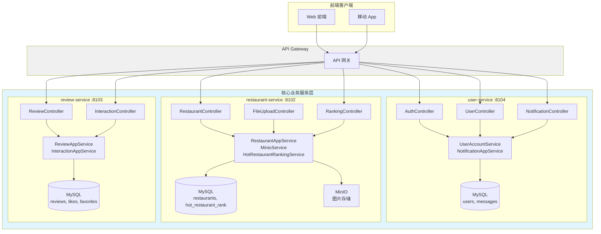
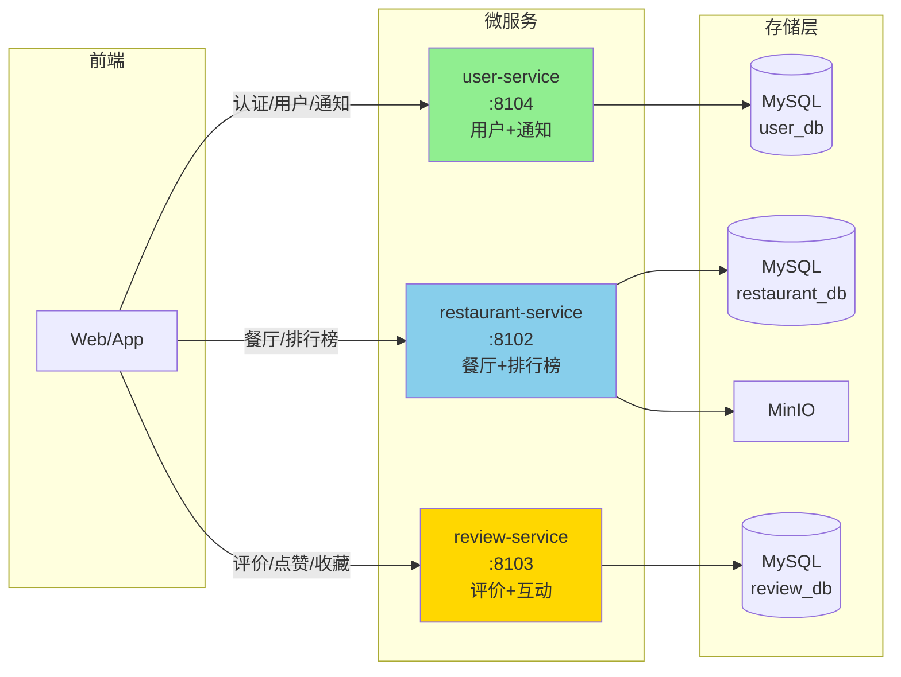
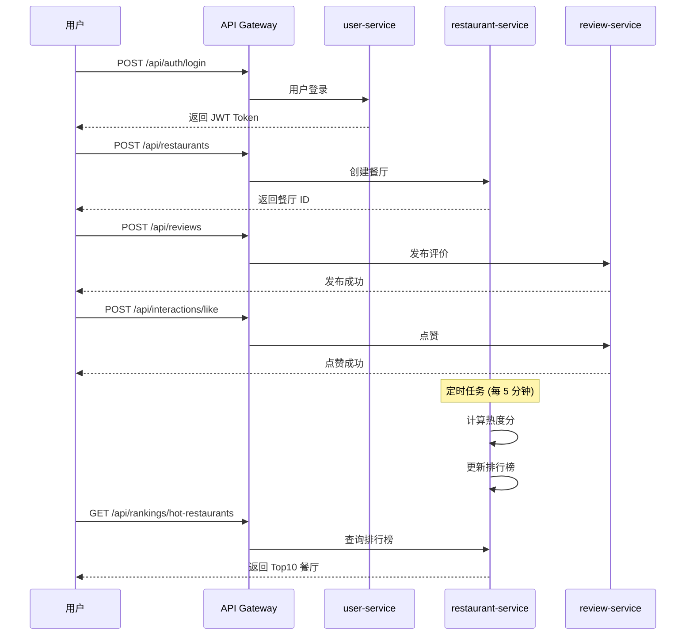

# Campus Review 微服务架构分析报告

## 一、微服务列表与功能

### 当前架构（优化后）

| 序号 | 服务名 | 端口 | 功能作用 | 服务类型 |
|------|--------|------|----------|----------|
| 1 | **user-service** | 8104 | 用户注册、登录、JWT 签发、Token 刷新、用户信息管理、站内消息通知 | 核心业务服务 |
| 2 | **restaurant-service** | 8102 | 餐厅信息 CRUD、图片上传 (MinIO)、餐厅搜索、热门餐厅排行榜 | 核心业务服务 |
| 3 | **review-service** | 8103 | 评价发布、评价查询、点赞/收藏互动功能 | 核心业务服务 |

### 原始架构（已废弃）

| 序号 | 服务名 | 原端口 | 状态 | 说明 |
|------|--------|--------|------|------|
| 1 | interaction-service | 8084 | ❌ 已合并 | 合并到 review-service |
| 2 | notification-service | 8085 | ❌ 已合并 | 合并到 user-service |
| 3 | ranking-service | 8086 | ❌ 已合并 | 合并到 restaurant-service |
| 4 | admin-service | 8088 | ❌ 已删除 | BFF 编排层冗余 |

---

## 二、各微服务 API 接口详情

### 2.1 user-service (用户服务) - 端口 8104

| 接口路径 | 方法 | 说明 |
|----------|------|------|
| `/api/auth/register` | POST | 用户注册 |
| `/api/auth/login` | POST | 用户登录 (签发 JWT) |
| `/api/auth/refresh` | POST | 刷新 Access Token |
| `/api/users/me` | GET | 获取当前用户信息 |
| `/api/notifications/send` | POST | 投递消息 |
| `/api/notifications/inbox` | GET | 查询收件箱 |
| `/api/notifications/{id}/read` | POST | 标记已读 |

### 2.2 restaurant-service (餐厅服务) - 端口 8102

| 接口路径 | 方法 | 说明 |
|----------|------|------|
| `/api/restaurants` | POST | 创建餐厅 (JSON) |
| `/api/restaurants/with-image` | POST | 创建餐厅 (带图片) |
| `/api/restaurants/{id}` | GET | 查询餐厅详情 |
| `/api/restaurants/by-ids` | GET | 批量查询餐厅 |
| `/api/restaurants` | GET | 搜索餐厅 |
| `/api/rankings/hot-restaurants` | GET | 热门餐厅排行榜 |
| `/api/files/upload` | POST | 文件上传到 MinIO |

### 2.3 review-service (评价服务) - 端口 8103

| 接口路径 | 方法 | 说明 |
|----------|------|------|
| `/api/reviews` | POST | 发布评价 |
| `/api/reviews?restaurantId=` | GET | 查询餐厅评价 |
| `/api/reviews/me` | GET | 查询我的评价 |
| `/api/interactions/like` | POST | 点赞 |
| `/api/interactions/unlike` | POST | 取消点赞 |
| `/api/interactions/favorite` | POST | 收藏 |
| `/api/interactions/unfavorite` | POST | 取消收藏 |
| `/api/interactions/count` | GET | 查询互动计数 |

---

## 三、数据库架构

### 3.1 user-service 数据库 (campus_review_user)

| 表名 | 说明 |
|------|------|
| `users` | 用户账户表 |
| `messages` | 站内消息表 |

### 3.2 restaurant-service 数据库 (campus_review_restaurant)

| 表名 | 说明 |
|------|------|
| `restaurants` | 餐厅信息表 |
| `hot_restaurant_rank` | 热门餐厅排行榜 |

### 3.3 review-service 数据库 (campus_review_review)

| 表名 | 说明 |
|------|------|
| `reviews` | 评价表 |
| `likes` | 点赞表 |
| `favorites` | 收藏表 |

---

## 四、架构优化说明

### 4.1 已完成的优化

| 优化项 | 原架构 | 新架构 | 收益 |
|--------|--------|--------|------|
| **服务数量** | 7 个微服务 | 3 个微服务 | 减少 57% 运维复杂度 |
| **服务间调用** | Feign 调用链路长 | 无跨服务调用 | 消除网络延迟和故障点 |
| **数据库** | 7 个独立数据库 | 3 个数据库 | 减少连接池开销 |
| **端口管理** | 7 个端口 | 3 个端口 | 简化配置和监控 |

### 4.2 合并详情

| 原服务 | 合并到 | 合并内容 |
|--------|--------|----------|
| interaction-service | review-service | 点赞/收藏功能、likes/favorites 表 |
| notification-service | user-service | 消息通知功能、messages 表 |
| ranking-service | restaurant-service | 排行榜功能、hot_restaurant_rank 表 |
| admin-service | ❌ 删除 | BFF 编排层冗余，前端直接调用各服务 |

### 4.3 架构优势

1. **简化部署**: 3 个服务独立部署，无服务间依赖
2. **降低延迟**: 本地方法调用替代 RPC
3. **提高可靠性**: 无网络故障点
4. **易于测试**: 单体测试覆盖完整业务流程
5. **降低成本**: 减少基础设施和运维开销

---

## 五、微服务架构图 (Mermaid)

### 5.1 当前架构图（优化后）

### 5.2 简化调用关系图

### 5.3 数据流向图

---

## 六、端口汇总

| 服务名 | 端口 | 说明 |
|--------|------|------|
| user-service | 8104 | 用户服务（原 8101 端口被占用） |
| restaurant-service | 8102 | 餐厅服务 |
| review-service | 8103 | 评价服务 |

---

## 七、技术栈汇总

| 技术 | 版本 | 用途 |
|------|------|------|
| Spring Boot | 3.2.12 | 应用框架 |
| Spring Cloud | 2023.0.5 | 微服务框架 |
| Spring Cloud Alibaba | 2022.0.0.0 | Nacos 注册/配置中心 |
| MyBatis-Plus | 3.5.5 | ORM 框架 |
| MySQL | 8.0 | 关系型数据库 |
| MinIO | - | 对象存储 |
| JWT | - | Token 认证 |
| SpringDoc OpenAPI | 2.3.0 | API 文档 |
| Flyway | 9.22.3 | 数据库版本管理（已禁用） |

---

## 八、配置说明

### 8.1 本地开发配置

所有服务的 `application.yml` 已配置：

- **Nacos**: 已禁用（本地开发不需要）
- **Flyway**: 已禁用（手动执行 schema.sql）
- **MySQL**: root/1234，数据库已创建
- **MinIO**: localhost:9000（restaurant-service）

### 8.2 数据库初始化

数据库表通过 `schema.sql` 手动创建：

- `campus_review_user`: users, messages
- `campus_review_restaurant`: restaurants, hot_restaurant_rank
- `campus_review_review`: reviews, likes, favorites

---

## 九、总结

### 架构优化成果

| 指标 | 优化前 | 优化后 | 改进 |
|------|--------|--------|------|
| 微服务数量 | 7 个 | 3 个 | ↓ 57% |
| 数据库数量 | 7 个 | 3 个 | ↓ 57% |
| 服务间调用 | 4 个 Feign Client | 0 | ↓ 100% |
| 端口数量 | 7 个 | 3 个 | ↓ 57% |

### 架构优势

1. ✅ **简化部署**: 3 个独立服务，无服务间依赖
2. ✅ **降低延迟**: 本地方法调用替代 RPC
3. ✅ **提高可靠性**: 无网络故障点
4. ✅ **易于测试**: 单体测试覆盖完整业务流程
5. ✅ **降低成本**: 减少基础设施和运维开销

### 服务职责清晰

- **user-service**: 用户认证 + 消息通知
- **restaurant-service**: 餐厅管理 + 排行榜
- **review-service**: 评价 + 点赞收藏
